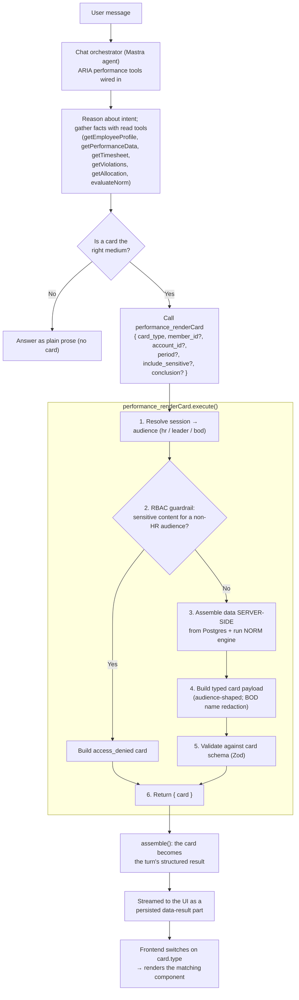

# ARIA Agent Response Cards — Generation Logic & UI Contract

Audience: anyone building the **card renderers** on the frontend, plus reviewers who
want to understand how/when the agent decides to emit a card.

This document covers two things:

1. **How the agent generates a card** — the end-to-end flow, the decision logic for
   *whether* to emit a card and *which* type, and how RBAC/redaction is enforced.
2. **The JSON contract for every card type** — a field reference and a concrete
   example per card, so the UI can implement rendering against a stable shape.

---

## 1. How a card is generated

### 1.1 End-to-end flow

```
User message
   │
   ▼
Chat orchestrator (a Mastra agent)         ← the ARIA performance tools are wired in here
   │  reasons about intent; gathers facts with the read tools
   │  (performance_getEmployeeProfile / getPerformanceData / getTimesheet /
   │   getViolations / getAllocation / evaluateNorm)
   │
   ├─ decides a card is the right medium ──► calls the tool:  performance_renderCard
   │                                              { card_type, member_id?, account_id?,
   │                                                period?, include_sensitive?, conclusion? }
   │                                                   │
   │                                                   ▼
   │                                         performance_renderCard.execute()
   │                                            1. resolve session → audience (hr/leader/bod)
   │                                            2. RBAC guardrails (see §1.4)
   │                                            3. assemble data SERVER-SIDE from Postgres
   │                                               (+ run the deterministic NORM engine)
   │                                            4. build the typed card payload
   │                                            5. validate against the card schema (Zod)
   │                                            6. return { card }
   │
   ▼
Orchestrator result assembly (`assemble()`)
   │  detects the renderCard output and makes the card the turn's structured result
   │
   ▼
Streamed to the UI as a persisted `data-result` part
   │
   ▼
Frontend switches on `card.type` and renders the matching component
```

The same flow as a Mermaid diagram:



Key properties:

- **The model never hand-writes the card JSON.** It only *chooses* to call the tool,
  the `card_type`, and the scope (member/account/period). The tool builds the payload
  from real data and validates it against the schema, so the shape is guaranteed and
  the numbers cannot be hallucinated.
- **The card is a discriminated union on `type`.** The UI renders by switching on
  `card.type` — that field is always present and is the only thing the renderer must
  branch on.
- **Cards are the exception, not the default.** Most answers are plain prose. A card is
  emitted only when it genuinely fits (see §1.2).

### 1.2 Decision logic — *whether* to emit a card

The agent is instructed to emit a card **only** when an answer is better shown as a
structured card than as prose. It must **not** emit a card for:

- greetings / small talk,
- clarifying questions,
- yes/no or short factual replies,
- definitions or general explanations.

When it does emit a card, it adds **at most one short sentence** of accompanying prose
and does not restate the card's contents.

### 1.3 Decision logic — *which* card type

The agent picks exactly one `card_type` based on the request:

| If the user asks for…                                                        | Card type                  |
|------------------------------------------------------------------------------|----------------------------|
| One employee's full performance picture / profile / report                   | `employee_profile_report`  |
| A quick single-employee snapshot inline in chat (fewer fields)               | `inline_transcript`        |
| "Who is at risk" on a team / account (a roster)                              | `at_risk_list`             |
| An account- or workforce-level risk roll-up (aggregate, no individual focus)| `account_summary`          |
| About to state a **sensitive conclusion** (PIP, attrition, perf verdict)     | `human_review_flag`        |
| (not requested directly — produced by the guardrail; see §1.4)               | `access_denied`            |

`employee_profile_report` and `inline_transcript` require `member_id`.
`at_risk_list` / `account_summary` accept an optional `account_id` (e.g. `"ACC-B"`) and
`period` (e.g. `"2026-04"`) for scoping. `human_review_flag` requires a `conclusion`
string.

### 1.4 RBAC & redaction (where `access_denied` comes from)

The audience tier is resolved from the **session role**, never from tool input:

| Role slug              | Audience | What they get                                                        |
|------------------------|----------|----------------------------------------------------------------------|
| `performance.hr`       | `hr`     | Full access, including sensitive HR fields                           |
| `performance.manager`  | `leader` | Full profiles + rosters for their team; **no** promotion/salary data |
| `performance.bod`      | `bod`    | Aggregate/workforce views; individual **names redacted in lists**    |
| (none / employee)      | `bod`    | Least-privileged default (fail-safe)                                 |

Guardrails enforced inside the tool:

- **Sensitive content is HR-only.** If a non-HR audience requests promotion readiness,
  salary band, or HR notes (`include_sensitive: true`), the tool returns an
  **`access_denied`** card instead of the data.
- **BOD aggregate guardrail.** In `at_risk_list`, the BOD audience sees `member_id` in
  the `name` field (individual names are not surfaced in a list); HR/Leader see the name.
- **Field redaction** is also applied at the data-retrieval boundary, so sensitive
  values never reach the model context for non-HR audiences.

> Note on names: the `performance.*` database stores **no employee names** (PII is not
> held there; `member_id` is the tenant-local identifier). So in DB-backed responses the
> `name` field equals the `member_id` (e.g. `"EMP-031"`). If real display names are
> wanted later, that's a separate cross-module lookup.

### 1.5 Data provenance (anti-hallucination)

- All values come from the `performance.*` Postgres schema (employee master, performance
  by project, timesheet, violations, allocation) and the **deterministic NORM engine**
  (which classifies risk in code, never by the LLM).
- `riskSignals` are built from triggered NORM classifications only (e.g. `"KPI: At Risk"`)
  — never raw numbers re-thresholded by the model.

---

## 2. The card contract

### 2.1 Envelope

Every payload is an object with a discriminator field `type`. The UI should switch on it:

```ts
type CardType =
  | 'employee_profile_report'
  | 'inline_transcript'
  | 'at_risk_list'
  | 'account_summary'
  | 'access_denied'
  | 'human_review_flag';
```

The card arrives on the frontend inside the turn's structured result, i.e.
`data.card` where `data.card.type` selects the renderer.

### 2.2 Shared sub-types

```ts
// 4-level risk used by badges. (Domain "critical" collapses into "high".)
type CardRiskLevel = 'high' | 'medium' | 'low' | 'none';

// A labelled metric line (used by inline_transcript).
interface CardMetric {
  label: string;
  value: string;
  emphasis: 'normal' | 'warn' | 'danger'; // visual hint; defaults to 'normal'
}
```

Suggested badge colours (UI's choice): `high` → red, `medium` → amber, `low` → green,
`none` → neutral. `emphasis`: `danger` → red text, `warn` → amber text, `normal` → default.

---

## 3. Card catalog (field reference + JSON example)

### 3.1 `employee_profile_report`

Full single-employee report. The headline card for "give me the profile of X".

| Field            | Type                                             | Notes                                        |
|------------------|--------------------------------------------------|----------------------------------------------|
| `type`           | `"employee_profile_report"`                      | discriminator                                |
| `employee`       | `{ memberId: string; name: string; role: string }` | `name` may equal `memberId` (no PII in DB)   |
| `riskBadge`      | `CardRiskLevel`                                  | composite risk                               |
| `account`        | `string \| null`                                 | e.g. `"Account B"`; null if unallocated      |
| `reviewPeriod`   | `string`                                         | human label, e.g. `"April 2026"`             |
| `kpi`            | `{ score: number; target: number; unit: string }`| render `score` vs `target` (e.g. a bar)      |
| `overtime`       | `{ hours: number; limit: number; unit: string } \| null` | null if no timesheet                 |
| `openViolations` | `number`                                         | open compliance cases                        |
| `allocationPct`  | `number \| null`                                 | e.g. `110` = 110%                            |
| `normResult`     | `string`                                         | verdict label, e.g. `"At Risk"`              |
| `riskSignals`    | `string[]`                                       | plain-language signals; may be empty         |

```json
{
  "type": "employee_profile_report",
  "employee": { "memberId": "EMP-031", "name": "EMP-031", "role": "Senior DevOps Engineer" },
  "riskBadge": "high",
  "account": "Account B",
  "reviewPeriod": "April 2026",
  "kpi": { "score": 2.2, "target": 3, "unit": "pt" },
  "overtime": { "hours": 48, "limit": 40, "unit": "h" },
  "openViolations": 1,
  "allocationPct": 110,
  "normResult": "At Risk",
  "riskSignals": ["KPI: At Risk", "Compliance: Open Cases", "Compliance: Flagged"]
}
```

### 3.2 `inline_transcript`

Compact in-chat answer card (an "ARIA response" card) — fewer fields than the full report.

| Field         | Type                                              | Notes                                  |
|---------------|---------------------------------------------------|----------------------------------------|
| `type`        | `"inline_transcript"`                             | discriminator                          |
| `agentName`   | `string`                                          | defaults to `"ARIA"`                   |
| `intro`       | `string`                                          | one-line lead-in                       |
| `metrics`     | `CardMetric[]`                                    | label/value rows with emphasis         |
| `footerBadge` | `{ label: string; tone: CardRiskLevel } \| null`  | e.g. `High risk`; null when no risk    |
| `footerNote`  | `string \| null`                                  | e.g. `"Flagged for review"`            |

```json
{
  "type": "inline_transcript",
  "agentName": "ARIA",
  "intro": "Here is the performance profile for EMP-031 for April 2026.",
  "metrics": [
    { "label": "KPI", "value": "2.2 (target 3)", "emphasis": "danger" },
    { "label": "Overtime", "value": "48h (+8h over limit)", "emphasis": "warn" },
    { "label": "Violations", "value": "1 open", "emphasis": "warn" },
    { "label": "NORM result", "value": "At Risk", "emphasis": "danger" }
  ],
  "footerBadge": { "label": "High risk", "tone": "high" },
  "footerNote": "Flagged for review"
}
```

### 3.3 `at_risk_list`

Multi-employee risk roster (Leader view). For BOD, `name` is redacted to `memberId`.

| Field       | Type     | Notes                  |
|-------------|----------|------------------------|
| `type`      | `"at_risk_list"` | discriminator   |
| `title`     | `string` | e.g. `"At-risk employees — Account B, April 2026"` |
| `employees` | `Array<{ memberId: string; name: string; riskBadge: CardRiskLevel; summary: string; recommendedAction: string }>` | one row per at-risk employee |

```json
{
  "type": "at_risk_list",
  "title": "At-risk employees — Account B, April 2026",
  "employees": [
    {
      "memberId": "EMP-031",
      "name": "EMP-031",
      "riskBadge": "high",
      "summary": "Low KPI (<2.5); High-Risk Violation",
      "recommendedAction": "Schedule 1:1, review workload allocation"
    },
    {
      "memberId": "EMP-044",
      "name": "EMP-044",
      "riskBadge": "medium",
      "summary": "Multiple Open Violations; Lateness Pattern",
      "recommendedAction": "Review project load, consider coaching"
    },
    {
      "memberId": "EMP-019",
      "name": "EMP-019",
      "riskBadge": "medium",
      "summary": "Below Expectations; Benched",
      "recommendedAction": "Review project load, consider coaching"
    }
  ]
}
```

### 3.4 `account_summary`

Account / workforce-level risk roll-up (BOD view).

| Field            | Type                                                | Notes                          |
|------------------|-----------------------------------------------------|--------------------------------|
| `type`           | `"account_summary"`                                 | discriminator                  |
| `title`          | `string`                                            | e.g. `"Talent risk overview — All accounts"` |
| `counts`         | `{ high: number; medium: number; low: number }`     | population breakdown           |
| `totalEmployees` | `number`                                            | total in scope                 |
| `highPct`        | `number`                                            | % flagged high-risk (for a headline bar) |
| `narrative`      | `string`                                            | one-paragraph framing          |

```json
{
  "type": "account_summary",
  "title": "Talent risk overview — All accounts",
  "counts": { "high": 8, "medium": 22, "low": 94 },
  "totalEmployees": 124,
  "highPct": 6,
  "narrative": "Overall talent risk is moderate. 8 employees flagged high-risk require manager action out of 124 in scope."
}
```

### 3.5 `access_denied`

RBAC guardrail card — returned when the audience lacks access to what was requested.

| Field         | Type     | Notes                                         |
|---------------|----------|-----------------------------------------------|
| `type`        | `"access_denied"` | discriminator                        |
| `title`       | `string` | defaults to `"Access restricted"`             |
| `message`     | `string` | what was denied and why                       |
| `hint`        | `string \| null` | follow-up guidance                    |
| `currentRole` | `string` | e.g. `"Leader role"`                          |
| `requiredRole`| `string` | e.g. `"HR role required"`                     |

```json
{
  "type": "access_denied",
  "title": "Access restricted",
  "message": "Your current role Leader does not have permission to view promotion readiness or sensitive HR notes.",
  "hint": "Contact your HR administrator if you need access to this information.",
  "currentRole": "Leader role",
  "requiredRole": "HR role required"
}
```

### 3.6 `human_review_flag`

Sensitive conclusion held for human approval before it is shared/actioned. The UI
typically renders Acknowledge / Decline affordances around it.

| Field        | Type     | Notes                                          |
|--------------|----------|------------------------------------------------|
| `type`       | `"human_review_flag"` | discriminator                     |
| `title`      | `string` | defaults to `"Requires human review"`          |
| `badge`      | `string \| null` | defaults to `"SENSITIVE"`              |
| `rationale`  | `string` | why this needs a human                         |
| `conclusion` | `string` | the sensitive conclusion itself                |

```json
{
  "type": "human_review_flag",
  "title": "Requires human review",
  "badge": "SENSITIVE",
  "rationale": "The following conclusion involves sensitive performance data and must be reviewed by an authorized HR officer before being shared or actioned.",
  "conclusion": "EMP-031 is flagged for potential performance improvement plan (PIP) consideration based on the 3-month KPI trend."
}
```

---

## 4. Frontend integration notes

1. **Branch on `card.type`** — it is always present and is the only discriminator.
   Default branch: render nothing (or a small "unsupported card" note) for forward-compat.
2. **Treat unknown extra fields leniently** — render what you recognise; ignore the rest.
   New fields may be added; the `type` set is stable.
3. **Nullable fields** — `account`, `overtime`, `allocationPct`, `footerBadge`,
   `footerNote`, `hint` can be `null`; guard before rendering.
4. **`CardMetric.emphasis`** and **`riskBadge`/`tone`** are visual hints — map them to
   your palette (suggested: high/danger = red, medium/warn = amber, low = green,
   none/normal = neutral).
5. **`name` may equal `memberId`** (no PII stored). Don't assume a human name.
6. The agent's **prose still streams as a normal text part** alongside the card — render
   both; the card is the structured artifact, the prose is the short summary.

---

## 5. Quick reference — all six `type` values

```
employee_profile_report   full single-employee report
inline_transcript         compact in-chat answer card
at_risk_list              multi-employee risk roster (names redacted for BOD)
account_summary           aggregate workforce risk roll-up
access_denied             RBAC guardrail (audience lacks access)
human_review_flag         sensitive conclusion held for human approval
```

The authoritative schema lives in code at
`packages/performance/src/backend/cards/schema.ts` (exported as types via
`@seta/performance/contracts`); these examples mirror it.
